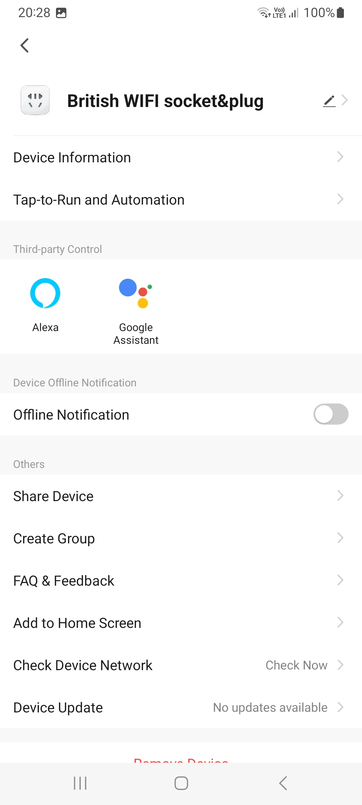
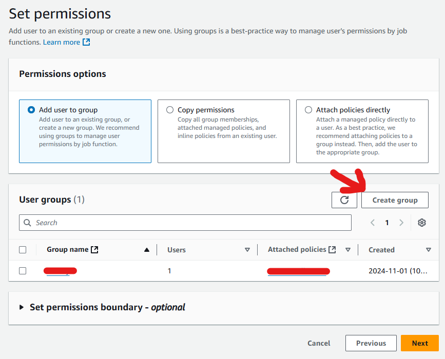
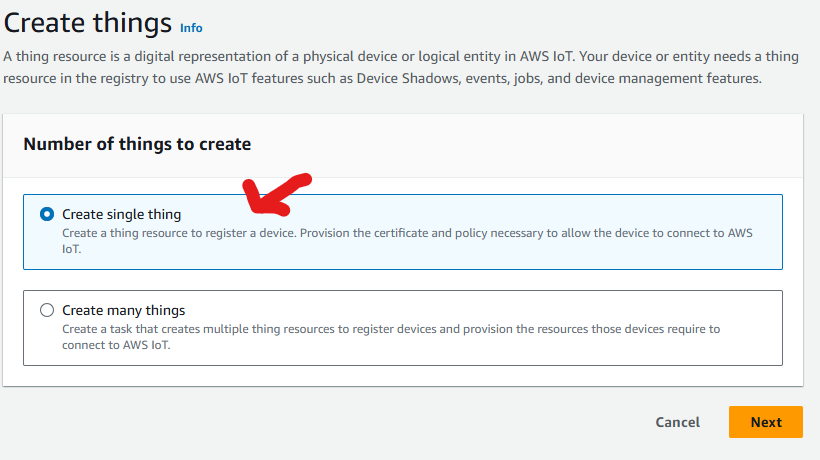
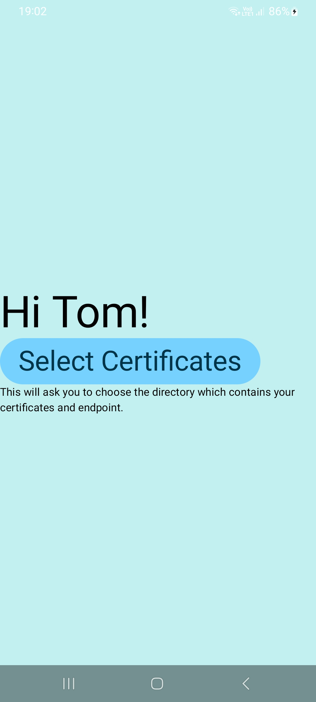

# Auto food cooker

This document should note the steps taken to try and make a solution that allows me to cook a meal before heading home from work.

## Contents

1. [Motivation](#motivation)
2. [Getting a smart cooker](#getting-a-smart-cooker)
3. [Getting a transformer](#getting-a-transformer)
    1. [The transformer bought](#the-transformer-bought)
    2. [Getting a smart plug for this](#getting-a-smart-plug-for-this)
        1. [Connecting the smart plug](#connecting-the-smart-plug)
4. [Connecting to the smart cooker](#connecting-to-the-smart-cooker)
    1. [Limitations](#limitations)
        1. [Circumventing the need to push a button by using Google home (kind of)](#circumventing-the-need-to-push-a-button-by-using-google-home-kind-of)
            1. [Limitations of this](#limitations-of-this)
        2. [Installing Google Assistant (and Alexa)](#installing-google-assistant-and-alexa)
5. [Creating a smart button pusher](#creating-a-smart-button-pusher)
    1. [What already exists](#what-already-exists)
        1. [Switch bot](#switch-bot)
    2. [Creating a button pusher](#creating-a-button-pusher)
        1. [Items required](#items-required)
    3. [Setting up an AWS account for this project](#setting-up-an-aws-account-for-this-project)
        1. [Noting the pricing for Iot Core](#noting-the-pricing-for-iot-core)
        2. [Creating a root user](#creating-a-root-user)
        3. [Creating the IoT user](#creating-the-iot-user)
        4. [Creating a budget action to deny the IoT user](#creating-a-budget-action-to-deny-the-iot-user)
            1. [Creating the role and policy for the action](#creating-the-role-and-policy-for-the-action)
            2. [Creating the budget action](#creating-the-budget-action)
    4. [Creating an IoT "thing"](#creating-an-iot-thing)
    5. ["Assembling" the physical components](#assembling-the-physical-components)
        1. [Modifying the enclosure](#modifying-the-enclosure)
        2. [Connecting the servo to the Pico/ jumper cables](#connecting-the-servo-to-the-pico-jumper-cables)
        3. [Placing the servo in the enclosure](#placing-the-servo-in-the-enclosure)
        4. [Setting up a smart plug for the button pusher](#setting-up-a-smart-plug-for-the-button-pusher)
    6. [Button pusher script](#button-pusher-script)
        1. [Setting up Thonny with the Pico](#setting-up-thonny-with-the-pico)
        2. [Implementing the script](#implementing-the-script)
            1. [Directory structure](#directory-structure)
        3. [Setting up the generated certificates](#setting-up-the-generated-certificates)
6. [Setting up an Android app to make a request](#setting-up-an-android-app-to-make-a-request)
7. [Positioning the button pusher](#positioning-the-button-pusher)
8. [What should happen once all this is set up](#what-should-happen-once-all-this-is-set-up)
9. [Improvements](#improvements)
    1. [Not buying an American appliance in the UK](#not-buying-an-american-appliance-in-the-uk)
    2. ["Niceifying" the Android app](#niceifying-the-android-app)
10. [References/ links](#references-links)

## Motivation

This project was started to reduce the time taken during weekdays to wait for food to be cooked.
Before setting up an "auto food cooker" I would go home and spend up to 30 minutes cooking a dish.

However, on some days I would be too tired to do so and would resort to culinary disasters such as what is seen below.


**Note that this does not work and that only the bottom pizza was cooked.**

## Getting a smart cooker

Naively, I thought I only needed to get a smart cooker, so I searched around and tried to find one that I would be able to use with assistant apps such as `Alexa` or `Google home`, the below cooker was a good candidate:

COSORI Smart 13-in-1 Air Fryer Toaster Oven Combo (CS130-AO)
<https://www.amazon.com/dp/B0CLP1YV8V/ref=pe_386300_440135490_TE_simp_item_image>

## Getting a transformer

After receiving the cooker, a problem was immediately clear, the cooker was made in the US and thus was not able to use the UK plugs or the voltage supplied by them.


To fix this, (instead of sending the cooker back) I looked for a transformer that would be able to convert the 220v to the 120v that the cooker required.

### The transformer bought

As the cooker uses 1800w I needed a transformer that would be able to handle this "wattage":

Voltage Converter 2000W Step Up Step Down Transformer Output 110V-120V
<https://www.ebay.co.uk/itm/204408580340>

Note that this was only "approved" after consulting with an electrician to make sure I wouldn't burn my house down.

### Getting a smart plug for this

To make sure the transformer and cooker aren't on all day, I also got a smart plug.

<https://shop.jacstores.co.uk/products/energizer-smart-wifi-plug?srsltid=AfmBOopfsVWlHVq8PUMIeN5vJsDE_hK0YrY127auAoFx3PHQ6W4GWuHc>

#### Connecting the smart plug

To connect to the smart plug, you will need to install the "Energizer smart" app. From there, you should then be able to add the device to Google Home. (Not required if using button pusher)

<https://play.google.com/store/apps/details?id=com.energizer.smart&hl=en>

From here, you can then connect the plug and then connect to either Alexa or Google Home.

1. Plug the plug into a wall/ switch on the power to it.
2. Open the energizer app:
3. Click on the `+` button in the top right corner:

4. From here, allow the required permissions to search for the device. (And WiFi password)
5. The plug should show in the listing
6. To add to Google Home, from the home page, click on the now-listed plug.

7. Click on the pencil in the top-right corner.

8. Click on "Third party control" and then `Google Assistant`


9. Follow the instructions to add the plug to Google Home

## Connecting to the smart cooker

To connect to the smart cooker, you will also need to install the VeSync app. From there, you should then be able to add the device to Google Home. (Not required if using button pusher)

<https://play.google.com/store/apps/details?id=com.etekcity.vesyncplatform&hl=en>

1. Plug the transformer into the smart plug.
2. Plug the cooker into the transformer
3. Switch on the plug and transformer.
4. Look for a WiFi symbol to appear on the cooker.
5. Open the VeSync app and click the `+` button in the top-right corner.

6. Select `kitchen` and then scroll to `C130-AO` (the cooker)

7. Enable the permissions required to connect to the cooker. (And WiFi password)
8. Go back to the home page and click `More`

9. To add to Google home: Click on "Third party Services".
10. Click on `Google Assistant`.
11. Follow the instructions to add the device.

### Limitations

After entering the details to cook a dish in VeSync, you will be prompted to press the start button:


Obviously, this is the exact opposite of what I wanted to do.

#### Circumventing the need to push a button by using Google Home (kind of)

The cooker advertised that you can activate it using either Alexa or Google Home, you just need to install the `Google Assistant` app or `Alexa` app. Neither is available on the Island via the Google app store (but are in other ways), so I installed Google Home instead:

Once you have connected to Google Home, you can start the cooker without pushing the button, kind of. To do this:

1. Install the Google Home app
2. Select `Devices`
3. Note that both the plug and cooker should be available.
4. For both the plug and oven
    1. Click on the cog in the top right corner
        1. Note that you can change the name of the device.
    2. Click "home"
    3. Add the device to a "home"/ make a "home" to connect to.
    4. Add the device to a room (Kitchen)
5. On a desktop, Using the Google account you connected VeSync to, go to Google Home <https://home.google.com/home>
6. Enter in the following YAML, with the devices corresponding to the names you set for them.

```yaml
metadata:
  name: "Start oven - no control" # Choose a short name that summarizes important starters and actions, like “Sunset lights”.
  description: Scripted automation # Write a detailed description that includes everything the automation does, like “At sunset, on weekdays, close blinds, turn on lights to 50%, and play the sunset playlist on certain speakers.”

automations:
  # “starters” and “actions” are required; “conditions” are optional.
  # Use Ctrl + Space to see autocomplete suggestions.

  # ---- STARTERS ---- #
  # Starters describe events that will start the automation.
  # To add more than one starter, duplicate the "- type" section under "starters".
  # If you add multiple starter events, any one of them happening will start the automation.
  starters:
    - type: assistant.event.OkGoogle
      eventData: query
      is: "Ok Google, start the oven today"

  # ---- CONDITIONS ---- #
  # Conditions are optional. Delete this section if it’s empty.
  # Conditions will prevent an automation from starting if the conditions aren’t met.
  # See g.co/home/script-editor-docs for documentation about how to use logical operators like “and”, “or”, and “not”.
  condition:
    type: device.state.OnOff # The basic on and off functionality for any device that has binary on and off, including plugs and switches as well as many future devices.
    state: on
    # Whether a device with an on/off switch is on or off. <code>true</code> if the device is on, <code>false</code> if the device is off. [available operators: is, isNot]
    is: true
    device: British WIFI socket&plug - Kitchen

  # ---- ACTIONS ---- #
  # Actions will start when a starter event takes place and all conditions are met.
  # Actions will start in the order they appear in the script and with any delay specified.
  # To add more than one action, duplicate the "- type" section under "actions".
  actions:
    - type: device.command.StartStop # Start or stop the device.
      # <code>true</code> to start device operation, <code>false</code> to stop.
      start: true
      devices: oven - Kitchen
```

##### Limitations of this

Unfortunately, Google home only allows `device.command.StartStop` which turns on the airfry option for 25 minutes...

After emailing Cosori about this, I was told that due to safety regulations, being able to remotely turn on devices was not allowed.


This is not a dig at their support, but it did give me confirmation that doing this the "approved" way was off the table.

###### Installing Google Assistant (and Alexa)

The voice commands advertised are allowed in the `Google Assistant` app, which, as noted earlier is not regularly available. With `Google Assistant` only being available in the US. This can be bypassed though by installing the APK directly:

<https://google-assistant.en.uptodown.com/android>

(Note that you can also install the Alexa app using the APK too)

This does require you to install an app to read the APK files:

<https://play.google.com/store/apps/details?id=com.mtv.sai&hl=en>

After doing this, you should be able to use the wider range of voice commands advertised by the VeSync app. However, these are still limited:


Using these, you can run the presets which can over or undercook the food.

Note that the name of the device is what is being listed, it is not a grammatical mistake that you can say "broil in oven" to start the oven.

## Creating a smart button pusher

Knowing that Google Home or VeSync aren't able to switch on the cooker to a specific setting or run remotely, the solution of using a smart button pusher was devised.

### What already exists

Before creating my own smart button pusher I thought to look at what was already available. To my surprise, the options were limited and expensive for the use case.

#### Switch bot

The switch bot seems to be the main brand for smart button pushers, they offer a button pusher that can be connected to via Bluetooth but requires a hub to connect using the internet:

[Button pusher on Amazon](https://www.amazon.co.uk/SwitchBot-Smart-Switch-Button-Pusher/dp/B07B7NXV4R/ref=sr_1_3?dib=eyJ2IjoiMSJ9.QRTGA0aptVR8ovRz_B8icIT-CFyG3Fkwj8reP-Ivpb4WrmHAyfjlvhSTotWw30q_NN5DcF53723dG9duDkJ3qIFIm_p7adEQaPunG2WWVYh4FYzx8_JQDv00c7y-N8rzM21Hr59R99Ra14ujne6ZzoTSjWvJkO-Ej2XzFblSr4wDDv6A3Zb6vFIyZ-4TiAEldzKOrlU13ocZszOxifPaOy5Zvll5gZ3I2YsLvQNA2jndhVCW1NVPpkhQRbLKWA9hCwg92xXKX2Q0RYjMDimww30Kg7Gu3HrUsDWRudVy6Y0.Oy6tw2fuZCGUp4RUBgQ9OOjXTLV9lJnvSLwT36mMu8Q&dib_tag=se&keywords=button%2Bpusher&nsdOptOutParam=true&qid=1731273796&sr=8-3&th=1)

[Hub on Amazon](https://www.amazon.co.uk/SwitchBot-Control-Universal-Conditioner-Connect-White/dp/B07TTH5TMW?ref_=ast_sto_dp&th=1)

Purchasing both of these would cost > £50 which I personally found to be too much for something that pushes a button.

### Creating a button pusher

But what is a smart button pusher? It is really a WiFi-enabled microcontroller and a servo which moves back and forth.

Seems simple, right?

#### Items required

* Raspberry Pi Pico WH (reduces the need to solder)
  * <https://thepihut.com/products/raspberry-pi-pico-w?variant=41952994787523>
* "Project enclosure" (General-Purpose Flanged Project Enclosure - 105x58x40mm × 1)
  * <https://thepihut.com/products/general-purpose-flanged-project-enclosure-105x58x40mm>
* A servo (Note that the torque needs to be high enough so that the button is pushed)
  * <https://thepihut.com/products/towerpro-servo-motor-mg92b-metal-gear>
* Male-to-female jumper cables
  * <https://thepihut.com/products/premium-female-male-extension-jumper-wires-20-x-6>
* Velcro tape
  * [Amazon velcro tape](https://www.amazon.co.uk/VELCRO-Brand-Fasteners-Perfect-Office/dp/B0017S83PI?dib=eyJ2IjoiMSJ9.9LylQbXg4FB4DEUEAWj0eGNSyv3Rs01br0UWw3sNwcx0ToD0EP_F5Sjl3jPnZmZiLp8l7mJKP6ioTgynXIlxl4BGjEZ2q8e95ZoRdt_0ZZqRwZOHQKxmiU-LRef7Ja7ONEak8sTU7UtDMyXyqaNqGDtB-9Uu5_JQ0_mZlCxUXVHWhPyDshLPuYb5nI75T5REeAOEkF57-I6U07piLrMqgjeqKqreLUXvL-ExiV21OJGipLtdzRyF8l3sPxGiN42xpjf64MeBbDDBRD_WtmPkECS88vha_RxVLKW7QIa50bw.zpqPqXqJS9-ufZOBHLC9PTcJCdyHu17ONpvBAbnypIY&dib_tag=se&keywords=velcro%2Btape%2Bself%2Badhesive&nsdOptOutParam=true&qid=1731275210&sr=8-5&th=1)
* Maker Pi Pico mini - Note that this is not critical, but the script was written to work with this, specifically so that a light shows when an internet connection is made (which can be done on the Pico too).
  * <https://thepihut.com/products/maker-pi-pico-mini>

To power the button pusher, you can either use a battery pack or plug it into a USB port, below are 2 options which have both been used with the button pusher:

* Digibuddy Model DB-11010 power bank (or any other 5v 2a battery pack) (Swedish site)
  * <https://www.amazon.se/-/en/Digibuddy-Powerbank-Mobile-Charger-DB-11010/dp/B00K9ES54K>
* Meross Smart Power Strip (4 + USB)
  * <https://www.amazon.co.uk/dp/B0C5X61VB2/ref=pe_27063361_487055811_TE_dp_1>

Note that powering the button pusher using a smart plug is recommended, this should reduce the risk of the Pico inside overheating, the battery dying before you need to use it, the general power consumption of the device and the amount of time it is connected to AWS, which is billed (for fractions of a penny).

Note also that I already had everything purchased from a previous project except for the velcro tape, enclosure and "power strip", so in terms of cost it was a steal!

### Setting up an AWS account for this project

The button pusher, as it connects to the internet, will need to be accessed securely/ from a public endpoint, to do this and to reduce the need to re-invent the wheel this project uses the AWS IoT Core service.

#### Noting the pricing for IoT Core

For 1 device which connects for a whole day and receives 10000 messages, you will be charged $0.01 for the month.

#### Creating a root user

To start off, in order to use AWS you need to create a "root" account, this account should only be created for the sake of billing and cost management.

All actions should be managed by IAM users or other services AWS provide for sign-in.

Using the link below, follow only the 1st section to "Sign up for an AWS account".

<https://docs.aws.amazon.com/kinesisvideostreams/latest/dg/gs-account.html#sign-up-for-aws>

Once you have done this, you will need to set up an MFA service/ key to secure this log in. (If you want to become broke within seconds, skip this step.)

1. Login to the AWS console with your root user.
2. Select `Security Credentials`
3. Select `Assign MFA device`:

4. Follow the instructions noted and give a device name


#### Creating the IoT user

Now that we have a secure root user, we will need to create a user which we can actually use safely.

1. Go to the AWS console
2. In the text box at the top, enter `IAM`

3. Click `Users` --> `Create user`

4. Give the user a name and click "Provide user access to the AWS Management Console"
5. Enter a password for the user and save it to a password vault/ manager.
6. Un-tick "Users must create a new password at next sign-in" as you will need to re-enter credentials.
7. Click next

8. When prompted, click "Create group"

9. Give the group a name
10. In "Permissions policies" search for "iotfullaccess"
11. Click on the `AWSIotFullAccess` AWS managed policy.
    1. Note that this is to start off with this user, once you know what you want to do with it, you can set more granular policies.
12. Click "Create user group"

13. Back on the select groups screen, select the group you just created.

14. Click next, then "Create user"

15. Note the Console sign-in URL, username and password if you didn't save it earlier.
16. Click "Go back to user screen"
17. Click on your newly-created user
18. Click on `Console access` --> `Enable MFA`

19. Go through the same steps you did to enable MFA for the root user.

#### Creating a budget action to deny the IoT user

Before logging out of the root account, you will probably want to make sure you don't bankrupt yourself accidentally. You can prevent this by setting actions on "budgets" so that after a threshold is reached, you can deny access for certain users:

##### Creating the role and policy for the action

1. Go to the AWS console
2. In the text box at the top, enter `IAM`
    1. 
3. Click `Roles` --> `Create Role`
    1. 
4. Click "AWS Service" if not already.
5. Type in "budgets"
6. Note if "budgets" is selected.
7. Click "Next"
    1. 
8. When prompted, enter "iamfull" into the search box
9. Select `IAMFullAccess` (is this overkill? Yes, does this make sure that the policy will applied? Yes)
    1. Note that you can reduce the access of the role by creating a custom policy which only sets iam policies on specified groups.
10. Click "Next"
    1. 
11. Give the role a name and description
12. Click "Create role"
    1. 

##### Creating the budget action

1. Go back to the AWS console.
2. Type in the search box "Billing and cost management" and click on the below result.
    1. 
3. Click "budgets"
    1. 
4. Click "Create budget"
5. Select the below options, you may want to use the "zero spend budget" instead of the "Monthly cost" one, this would just change what threshold you apply the "action" on.
    1. 
6. Click on the budget you just created.
7. Click "Edit alerts"
    1. 
8. Click "Next"
    1. 
9. In the alert for 100% threshold for "Actual" usage, select the previously-created "budget_action_role" IAM role for this.
10. Set the Action type to IAM Policy.
11. Set the existing IAM Policy to apply to the `AWSDenyAll` AWS managed IAM Policy.
    1. This denies access to all services for this group, **note that if resources have been created they will still need to be removed manually.**
12. Set the user group to the one you created.
13. Set "Do you want to automatically run this action when this threshold is exceeded?" to `Yes`.
    1. 
14. Click next.
15. Click save.

### Creating an IoT "thing"

Now we have a user and a policy to stop it from destroying our finances. We can actually use it.

As mentioned, the AWS service which the button pusher uses is AWS IoT Core, it acts like a queue system where messages are published to this accessible queue for IoT devices to read. The information stored in these messages, along with what "route" we set for them to go to can determine how the device may act. In this case however, we only want to send a simple message to activate the button push.

1. Log out of the root account.
    1. Make sure you have logged out of the root account.
    2. Have you logged out of the root account?
2. Log in using the IoT user you created.
3. Change the region you are in to eu-west-2 (London)
    1. 
4. In the console, enter IoT Core
    1. 
5. In the Iot Core console, click `All devices` --> `Things`
    1. 
6. Click "Create things"
    1. 
7. Click "Create single thing" then "Next"
    1. 
8. Give the thing a name, for reference the `main.py` script calls the thing `RaspberryPiPicoW` and will need to be changed if another name is given.
9. Click "Next"
    1. 
10. Click "Auto-generate a new certificate" then "Next
    1. 
11. Click "Create Policy"
    1. 
12. Click "JSON"
13. Enter in the below JSON:

    ```json
    {
      "Version": "2012-10-17",
      "Statement": [
        {
          "Effect": "Allow",
          "Action": "iot:Connect",
          "Resource": "*"
        },
        {
          "Effect": "Allow",
          "Action": "iot:Receive",
          "Resource": "*"
        },
        {
          "Effect": "Allow",
          "Action": "iot:Subscribe",
          "Resource": "*"
        },
        {
          "Effect": "Allow",
          "Action": "iot:Publish",
          "Resource": "*"
        }
      ]
    }
    ```

14. Click "Next".
    1. 
15. Go back to the other tab which lists the policies to choose for your thing and press the refresh button
16. Select the policy
17. Click "Create thing"
    1. 
18. **IMPORTANT** Download all of the certificates to a safe location. These will be how the Pico will access AWS and how any clients will be able to publish messages to the IoT queue.
19. Click "Done"
    1. 
20. Click on the thing you created.
    1. 
21. Select `Activity` --> `MQTT test client`
    1. 
22. Click "Connection details"
23. Note the "Endpoint", this is the public endpoint AWS exposes that you will use your credentials with.
    1. 

From this client, you can test sending messages to the MQTT queue which will be used by the Pico once it is set up.

### "Assembling" the physical components

Once you have an AWS account and a "Thing" to register the Pico as. It is time to put the pieces together.

#### Modifying the enclosure

The enclosure should be able to hold both the servo and Pico, however, to allow the pico to be powered and for the servo to actually move something the enclosure needs to be modified.

I took a Dremmel to the plastic box and cut 2 holes as seen below, one for the USB-B cable for the Pico and another for the servo:


Unfortunately, this was done via eye-balling what was required but seemed to work out.

#### Connecting the servo to the Pico/ jumper cables

The servo should have a 3-prong cable which you will need to connect your jumper cables with


Note that if you also have the Maker Pi Pico, you will need to "invert" the picture above and, instead of using a "lower" GPIO pin, GPIO pin 6 is used (and is referenced in the `main.py` script):


#### Placing the servo in the enclosure

Once you have made a hole for the servo, you should be able to place it so that the top sticks out of the "bottom" of the enclosure:


Once happy with the placement of the servo, use some double-sided tape to secure it into place.

Note that the servo comes with "rotors", these will need to be adjusted so lightly place one on the servo for now.

#### Setting up a smart plug for the button pusher

If you purchased the `Meross Smart Power Strip`, to set it up:

1. Install the `Meross` app from the play store: <https://play.google.com/store/apps/details?id=com.meross.meross&hl=en>
2. Once installed, plug the "surge protector" in.
3. Open the app and click the `+` button in the top right corner.
    1. 
4. Select `Smart Surge Protector`.
    1. 
5. Select `MSS425F` (Top right)
    1. 
6. Click "next" and grant the permissions to app to connect.
    1. 
7. Once connected you will be prompted if you want to connect to `Google Assistant` or `Alexa`, select the apps which you have installed onto your phone and follow the instructions (should just be a button to add Meross to google home)

### Button pusher script

#### Setting up Thonny with the Pico

To get the Pico to control the servo, a script will need to be copied onto it, to do this the Thonny IDE was used: <https://thonny.org/>

Once installed, you will need to install micropython onto the Pico:

1. Open Thonny.
2. If it is not open already open `View` --> `Files` and `View` --> `Shell`
3. Connect a USB-B cable to the Pico
4. Open `Run` --> `Configure interpreter`
5. Hold the "bootsel" button whilst connecting the USB (regular) part into your computer.
    1. Note that it is a lot easier to connect the USB whilst holding "bootsel" than connecting the USB-B into the Pico.

6. You should see the Pico is recognised on your machine as a drive.
7. Select the Pico drive.
8. Select the variant (Raspberry Pi Pico W/ Pico WH) and a version of MicroPython to install.

9. Click install.
10. Once installed, click the "Stop" button near the top left of the screen, this should bring up the Pico's folder structure.


#### Implementing the script

The script itself needs to be named `main.py` when copied to the Pico in order for it to be run when it is powered on.

This script connects to the internet using hard-coded values for the SSID and password. Copying in the script, along with the generated certificates into the "certs" directory should allow you to receive messages from AWS and have the servo move when the `sdk/test/python` topic is published to with a message of `{"state":"on"}`.

##### Directory structure

```text
.
│   main.py       -- Main script
|   button_pusher_log.log -- A log file which is generated on startup
├───lib           -- Libraries/ packages
└───certs         -- AWS-Generated Certificates
        cert.der 
        pkey.der
        AmazonRootCA1.der
```

#### Setting up the generated certificates

To make the certificates readable by the script, they need to be converted to DER format first:

```bash
openssl x509 -in d3cfd92b7c2dc6dde3671bff04c53dc97c591159375aefdd6023f2cdb6c3f8f3-certificate.pem.crt -out cert.der -outform DER
openssl pkey -in d3cfd92b7c2dc6dde3671bff04c53dc97c591159375aefdd6023f2cdb6c3f8f3-private.pem.key -out pkey.der -outform DER
openssl x509 -in AmazonRootCA1.pem -out AmazonRootCA1.der -outform DER
```

You can test that these work by running the following:

``` bash
openssl s_client -connect [ENDPOINT]-ats.iot.eu-west-2.amazonaws.com:8883 -CAfile ./AmazonRootCA1.pem -cert ./cert.der -certform DER -key ./pkey.der -keyform DER
```

1. Open Thonny/ Connect to the Pico as shown above.
2. Right-click in the folder explorer window for the Pico click "New Directory" and call it "certs".
3. In the "This Computer" panel in the file view, go to the location the certs were generated in.
4. In the Pico file view, double-click on the "certs" directory.
5. Right-click on the certificates on your machine and select "Upload to /certs"

6. In the "This Computer" panel in the file view, go to the location where the `main.py` file is located and copy it into the Pico's base directory (click on "Raspberry Pi Pico") for the Pico.
7. Go to `Tools` --> `Manage packages`.
8. Click `<INSTALL>` and search for the following packages:
    * network - Version 0.1
    * ssl - 0.2.1
    * umqtt.robust - 1.0.2
    * umqtt.simple - 1.4.0
    1. Note that these all are installed in the "lib" directory.
9. In the pico file view, double-click on `main.py` to edit it.
10. Search for `#START`
11. Under this section, you should see the below, fill in the details as such:

    * MQTT_ENDPOINT - The endpoint generated by AWS.
    * MQTT_CLIENT_ID - The name of the Thing you created.
    * SUB_TOPIC - The topic which will be subscribed to by the Pico.
    * SSID - The name of your WiFi network, you can find this by running the `check_internet.py` script on the Pico (requires the network library)
    * PASS - Your WiFi password
    * Also note that under "Servo control setup" you can set what pin the servo is being controlled by, in this case pin "6" is being used. (Pins 0-5 are being used by LEDs for the maker pi pico (Optional thing) which can affect the performance of the servo as they would be activated at the same time if placed on one of those pins)
12. Save the file, it should now be updated on the Pico.
13. Assuming you have connected the servo to the Pico, click on the green button to run the script.

14. As seen above, you should be able to publish messages to the MQTT queue via the AWS console which will be picked up.
    1. Note also that all stdout is logged to `button_pusher_log.log` which truncates itself once hitting 100kb, this can be used to debug an issue once you disconnect from Thonny.
    2. You also may see numbers showing during the servo movement, this should show the voltage which should be around 0.028, lower values may suggest the battery is low.

Once all this is set up, it should now be a case of applying the button pusher to the smart cooker, but what about sending messages from something that isn't the AWS console?

## Setting up an Android app to make a request

You should be able to make a curl request or use the MQTT test client in AWS to publish messages, but if you want to send the request from an Android phone you may need to create an app to do this (android does not like network-enabled python scripts).

Note that there is a Python script in this folder which makes the request called `client_send_request.py`, swapping "\[EDNPOINT\]" for your "AWS hash" should make the necessary request.

But, does that really count?

An android application which makes the request can be found in the directory, the app was tested on a Samsung Galaxy M32 (SM-M325FV/DS).

1. Install Android Studio <https://developer.android.com/studio>
2. Open the "ButtonPresser" project found in this directory.
3. Copy the non-altered certificate files (PEM format) to your phone in a safe location, all within the same directory.
    1. Call the certificate "certificate.pem.crt"
    2. Call the private key "private.pem.key"
    3. Call the Root certificate "root_cert.pem"
4. Edit the `endpoint-info.json` file in this directory so your AWS endpoint and topic are set.
5. Copy the `endpoint-info.json` file to the same location you copied the certificates to on your phone.

6. Clicking on "Select certificates" will prompt you to give the folder location you copied your certificates to, once selected the request will be sent and a pop-up will show to notify if the request was a success.

Note also that most of this application was generated by google Gemini, which really nicely integrates with Android Studio and "hard-carried" this part of the project.

## Positioning the button pusher

Once you have your button pusher, the last thing to be done is to put the button pusher on the cooker so that it actually pushes a button when activated.

Place the enclosure on the cooker so that the servo, when activated, moves the "rotor" piece which pushes the button.

This sounds simple but can be a challenge, you will need to adjust the angle for the rotor otherwise you may either rip off whatever is sticking the button pusher to the cooker or not press the button at all.

Testing the angle should consist of you powering on the Pico and sending messages to it either via requests or using the AWS Console. With yourself holding the button pusher so that you can determine the force of the button push or the location where the rotor is.

Once you have confirmed a place, stick some velcro tape on the cooker and the enclosure so that it can be stuck on.

## What should happen once all this is set up

Once all of this is set up, you should be able to set the granular options you want to set and, when prompted to press the on button, you now can. From anywhere.

<video controls>
  <source src="./images/button-push.mp4" type="video/mp4">
</video>

## Improvements

### Not buying an American appliance in the UK

The most notable improvement is the use of another appliance that does not require a transformer and would also mean that the apps which say work with the appliance would be widely available in the UK. But whats the fun in returning it?

### "Niceifying" the Android app

The Android apps was only made as a "its 4am, what can I do to make this work" addition to the project, further work can be done on it so that it looks nicer or be able to provide some alerts to note if the button pusher has subscribed to the MQTT queue.

## References/ links

* [Connecting to pico via AWS](https://community.aws/content/2fmIjiV6VfXnoN1ABMJHO5OYR0W/getting-started-with-pico-w-iot-core)
* [Connecting a Pico using Thonny](https://projects.raspberrypi.org/en/projects/getting-started-with-the-pico/3)
* [Maker Pi Pico Mini Github](https://github.com/CytronTechnologies/MAKER-PI-PICO/tree/main/Example%20Code/MicroPython)
* [An Amazon forum post showing an issue with the first links method](https://repost.aws/questions/QUnMyMEwxNT_e4TSDhDtjrbg/help-connecting-raspberry-pi-pico-w-to-aws-iot-core-using-micropython)
* [Using a servo with a Pico](https://randomnerdtutorials.com/raspberry-pi-pico-servo-motor-micropython/)
* [The Raspberry Pi data-sheet noting the result codes when connecting to the internet using the network library](https://datasheets.raspberrypi.com/picow/connecting-to-the-internet-with-pico-w.pdf)
  * Note that section `3.6.3` notes that the WiFi can be made a lot better by switching off power-saving mode.
* [Google Gemini](https://gemini.google.com/app)
* Various links for odds-and-ends:
  * [Solenoid](https://thepihut.com/search?q=solenoid&narrow_by=&sort_by=relevency&page=1).
  * [Mini solenoid](https://thepihut.com/products/mini-push-pull-solenoid-5v).
  * [Single relay](https://thepihut.com/products/single-channel-relay-for-raspberry-pi-pico).
  * [Wiki for relay](https://learn.sb-components.co.uk/Pico-Single-Channel-Relay-Hat).
  * [Github for relay](https://github.com/sbcshop/Pico-Single-channel-Relay-HAT/tree/main).
